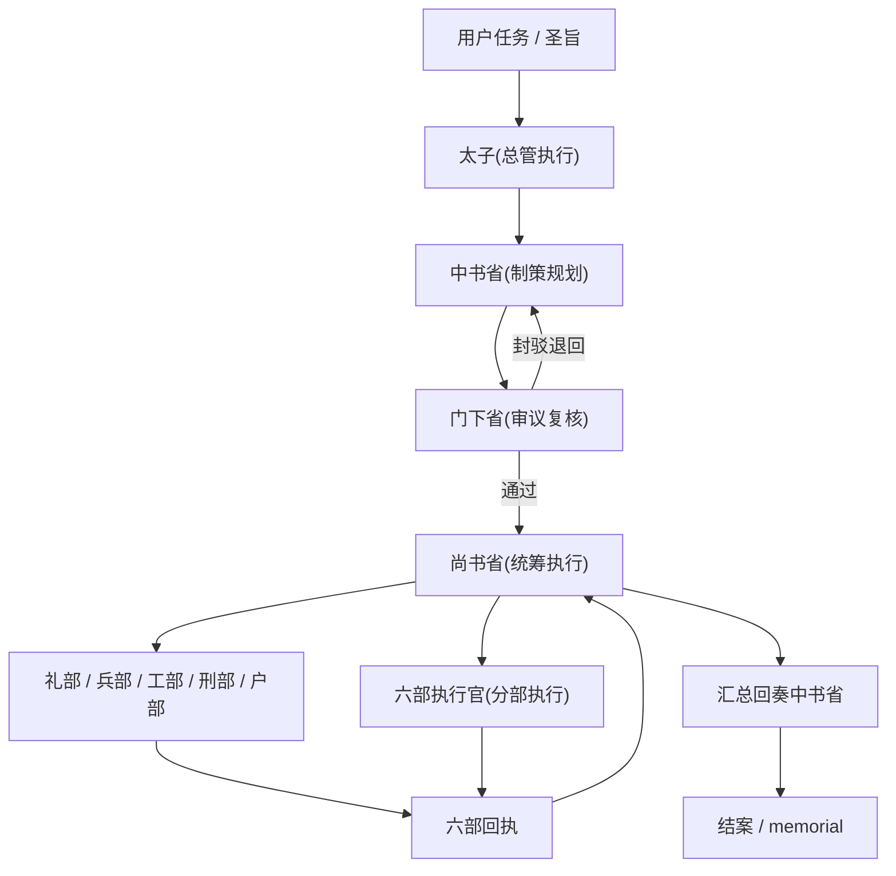
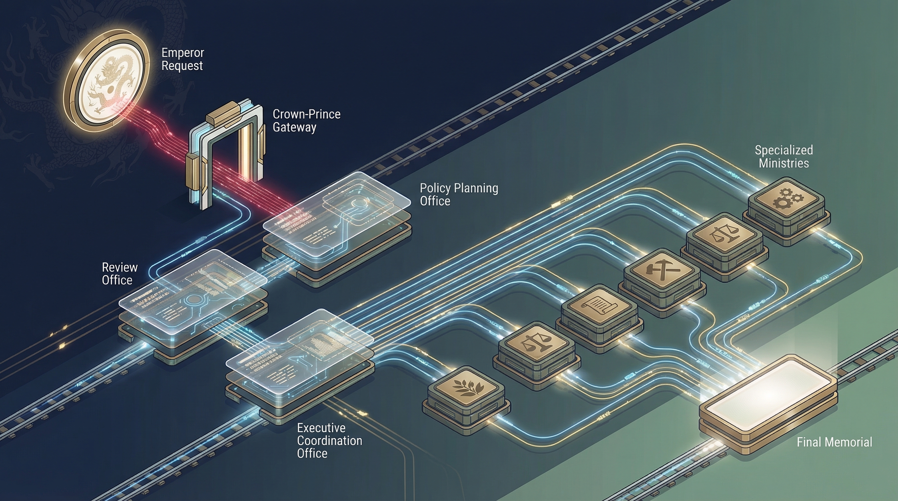
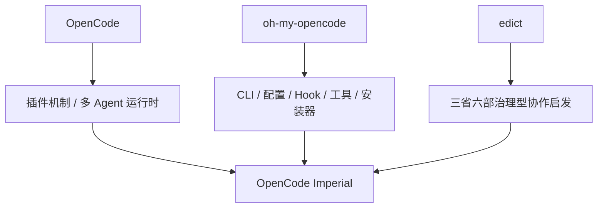

# OpenCode Imperial


把 OpenCode 的多 Agent 编排，改造成一套可审议、可派发、可回执、可审计的三省六部工作流。

这是一个基于 [oh-my-opencode](https://github.com/ShellMonster/oh-my-opencode) fork 的二次开发项目，运行在 OpenCode 插件与多 Agent 运行时之上，并参考了 [cft0808/edict](https://github.com/cft0808/edict) 的“三省六部”制度化协作思路。

当前默认对外名称：

- npm 包名：`opencode-imperial`
- CLI 命令：`opencode-imperial`
- 默认叙事：中文三省六部

## 30 秒理解

普通多 Agent 的问题，不是“不能协作”，而是：

- 任务怎么拆的，不透明
- 有没有审核，不透明
- 谁派给了谁，不透明
- 为什么卡住，不透明
- 中途能不能干预，往往也不行

`OpenCode Imperial` 解决的不是“多几个 Agent”，而是“把多 Agent 变成一套有制度约束的协作系统”：

```text
你（皇上） -> 太子（分拣） -> 中书省（制策规划） -> 门下省（审议复核）
-> 尚书省（统筹执行） -> 六部（并行执行） -> 回奏 / memorial
```

核心差异不是比谁能调用更多模型，而是：

- 有审核
- 有派发
- 有回执
- 有审计
- 有实时看板
- 能看到阻塞点和会话状态

## 为什么不是普通多 Agent

和“多个 Agent 自己聊完给你结果”的模式不同，这个项目把协作变成了制度流转。



这不是单纯的 metaphor，而是已经接入当前插件运行时的工作流层：

- `role_map` 角色映射
- `permission_matrix` 权限矩阵
- `中书省 -> 门下省 -> 尚书省 -> 六部 -> 中书省` 主链路
- 审议意见、六部回执、尚书省汇总回奏持久化
- 任务状态机与审计日志
- 停滞检测、重试、升级处理基础能力

## 对比原生多 Agent 体验

| 能力 | 原生多 Agent / 常见编排 | OpenCode Imperial |
|---|---|---|
| 审核机制 | 通常没有强制审核 | `门下省` 强制审议，可封驳退回 |
| 派发机制 | 谁调谁依赖 prompt 约定 | `尚书省` 统筹派发，权限矩阵受控 |
| 回执机制 | 子任务结果分散在会话里 | 六部回执持久化，可回收汇总 |
| 流转审计 | 一般较弱 | 完整 flow / progress / audit 记录 |
| 实时看板 | 通常没有或很弱 | 内置 dashboard + SSE |
| 阻塞定位 | 往往靠猜 | 有 bottleneck、会话监控、官员负载 |
| 并行多项目 | 易端口冲突 | 默认按工作区推导 dashboard 端口 |
| 中途控制 | 通常缺少统一入口 | 已支持 `stop / resume / cancel` |

一句话总结：

> 重点不是“多 Agent”，而是“治理型多 Agent”。

## 当前已经能做什么

### 1. 三省六部工作流

当前已经能跑通：

- `太子(总管执行)` 分拣工作指令
- `中书省(制策规划)` 制策与分解
- `门下省(审议复核)` 审议与退回
- `尚书省(统筹执行)` 派发与汇总
- 六部与分部执行官并行执行
- 回奏与 memorial 归档

### 2. Dashboard 看板

当前内置的轻量看板已经可用。


当前面板包括：

- 总览指标
- 任务列表与筛选
- 任务详情
- memorial summary
- recent audit
- 机构总览
- 流转漏斗
- bottleneck / stalled tasks
- 官员负载
- 官员详情
- 会话监控

### 3. 工程能力

这套系统当前还具备：

- 多工作区默认端口隔离
- `tasks.json` 并发写保护与原子写入
- npm 包、CLI 命令、schema 主路径切换到 `opencode-imperial`
- 中文化 Agent 展示名
- 安装器、CLI、README、配置文档第一轮收口



## 三省六部映射

当前 UI 展示名已经切到中文叙事，但内部兼容 key 仍保留旧名字，便于兼容上游配置和迁移。

| 展示名 | 内部 key | 职责 |
|---|---|---|
| `太子(总管执行)` | `sisyphus` | 顶层执行入口、总控任务推进 |
| `中书省(制策规划)` | `prometheus` | 制策、分解、规划 |
| `门下省(审议复核)` | `momus` | 审议、封驳、复核 |
| `尚书省(统筹执行)` | `atlas` | 统筹派发、回收回执、汇总回奏 |
| `六部执行官(分部执行)` | `sisyphus-junior` | 分部执行通用角色 |
| `工部(深度执行)` | `hephaestus` | 深度实现与复杂落地 |
| `礼部(文献检索)` | `librarian` | 文档、资料、知识检索 |
| `兵部(情报勘探)` | `explore` | 勘探、扫描、信息搜集 |
| `刑部(疑难会审)` | `oracle` | 疑难分析、复杂推理 |
| `户部(多模态审阅)` | `multimodal-looker` | 图片与多模态审阅 |
| `中书参议(方案顾问)` | `metis` | 策略顾问与方案参议 |

## 3 步快速开始

### 1. 安装

```bash
bunx opencode-imperial install
```

或者：

```bash
npm i -g opencode-imperial
opencode-imperial install
```

### 2. 验证

```bash
bunx opencode-imperial doctor
```

### 3. 运行

```bash
bunx opencode-imperial run "修复当前项目中的问题"
```

如果你已经在使用 OpenCode 或 onmyopencode，这就是最短上手路径。

## 最小配置

项目级或用户级配置推荐使用 `JSONC`。

```jsonc
{
  "imperial_workflow": {
    "enabled": true,
    "strict_review": true,
    "strict_mapping": true,
    "require_review_note": true,
    "max_review_round": 3,
    "stall_threshold_sec": 180,
    "max_retry": 1,
    "dashboard": {
      "enabled": true,
      "host": "127.0.0.1",
      "port": 7897,
      "refresh_ms": 1500
    }
  }
}
```

配置文件位置：

- 项目级：`.opencode/opencode-imperial.jsonc`
- 用户级：`~/.config/opencode/opencode-imperial.jsonc`

说明：

- `7897` 是基础端口
- 运行时会根据工作区自动推导实际端口，减少多项目同时运行时的冲突

## 项目来源

这个项目应理解为三层叠加：



也就是说：

1. **运行底座** 来自 OpenCode 的插件与多 Agent 运行时
2. **工程基础** 来自 `oh-my-opencode` 的 fork 与二次开发
3. **制度启发** 来自 `edict` 的三省六部协作框架

它不是 `oh-my-opencode` 的官方上游分支，也不是 `edict` 的移植版，而是面向当前需求继续演进出来的插件项目。

## 运行时产物

当前版本在开启 imperial workflow 后，会写入：

- `.sisyphus/imperial-workflow/tasks.json`
- `.sisyphus/imperial-workflow/audit.jsonl`

这里仍保留兼容路径，暂未迁到新品牌目录。

## 文档入口

- [Imperial Workflow](./docs/imperial-workflow.md)
- [Imperial Dashboard](./docs/imperial-dashboard.md)
- [安装指南](./docs/guide/installation.md)
- [CLI 参考](./docs/reference/cli.md)
- [配置参考](./docs/reference/configuration.md)

## 已知边界

当前还不是“完全平台化成品”，主要边界有：

- 人工干预台还没完整做完
- 模板 / 技能 / 模型控制台还没做完
- 运行时数据目录还没迁到新品牌路径
- 非主链路文档与个别 workflow 文件还残留上游命名
- 内部兼容 key 仍保留旧名，但不影响当前使用

