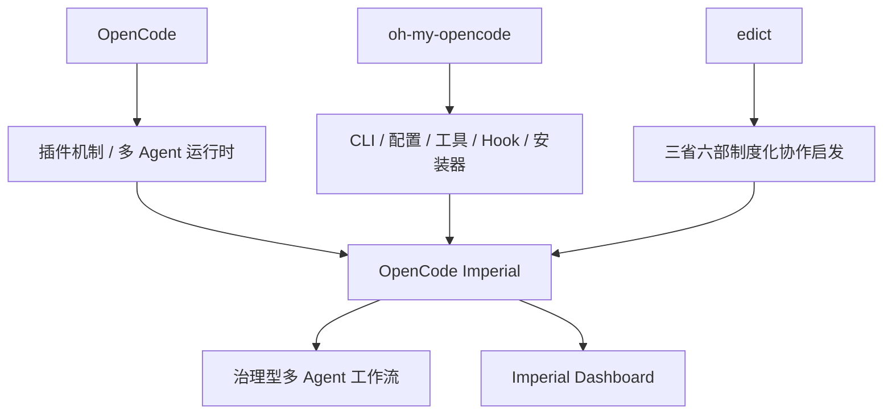
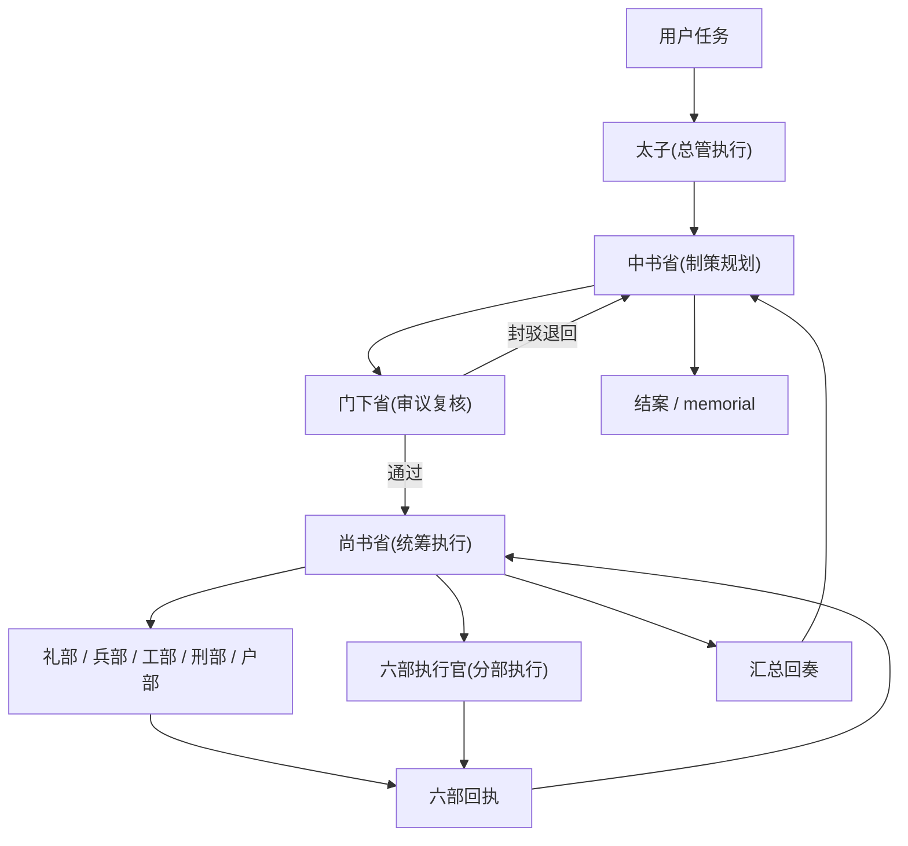
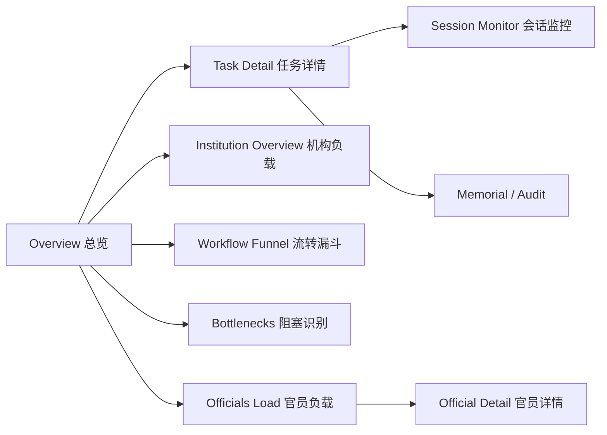

# OpenCode Imperial

`OpenCode Imperial` 是一个面向 OpenCode 的多 Agent 治理型插件。

它不是对上游的简单换皮，而是一个基于 [oh-my-opencode](https://github.com/ShellMonster/oh-my-opencode) fork 的二次开发项目：

- 继承 OpenCode 插件机制与多 Agent 编排能力
- 继承上游 `oh-my-opencode` 的工具链、安装器、CLI、配置体系
- 参考 [cft0808/edict](https://github.com/cft0808/edict) 的“三省六部”制度化协作思路
- 在此基础上补上审议、派发、回执、审计、看板等治理层能力

当前默认对外名称：

- npm 包名：`opencode-imperial`
- CLI 命令：`opencode-imperial`
- 默认叙事：中文三省六部

## 项目定位

这个项目适合解决的问题，不是“单 Agent 帮我写一段代码”，而是：

- 需要拆分规划、复核、统筹、执行的复杂任务
- 希望 Agent 协作过程可观察、可追踪、可审计
- 希望在运行中看到任务卡在哪一层、哪一部、哪个会话
- 希望后续继续加人工干预，而不是只看黑盒执行

一句话概括：

> 把 OpenCode 的多 Agent 编排，改造成一套带制度约束和可观测能力的三省六部工作流。

## 上游关系

本仓库和两个来源的关系如下：

1. **运行底座** 来自 OpenCode 的插件与多 Agent 运行时
2. **工程基础** 来自 `oh-my-opencode` 的 fork 与二次开发
3. **制度启发** 来自 `edict` 的三省六部协作框架



## 三省六部映射

当前 UI 展示名已经切到中文叙事，但内部兼容 key 仍保留旧名字，便于兼容上游配置和迁移。

| 展示名 | 内部 key | 职责 |
|---|---|---|
| `太子(总管执行)` | `sisyphus` | 顶层执行入口、总控任务推进 |
| `中书省(制策规划)` | `prometheus` | 制策、分解、规划 |
| `门下省(审议复核)` | `momus` | 审议、封驳、复核 |
| `尚书省(统筹执行)` | `atlas` | 统筹派发、回收回执、汇总回奏 |
| `六部执行官(分部执行)` | `sisyphus-junior` | 分部执行通用角色 |
| `工部(深度执行)` | `hephaestus` | 深度实现与复杂落地 |
| `礼部(文献检索)` | `librarian` | 文档、资料、知识检索 |
| `兵部(情报勘探)` | `explore` | 勘探、扫描、信息搜集 |
| `刑部(疑难会审)` | `oracle` | 疑难分析、复杂推理 |
| `户部(多模态审阅)` | `multimodal-looker` | 图片与多模态审阅 |
| `中书参议(方案顾问)` | `metis` | 策略顾问与方案参议 |

## 工作流长什么样

这套系统不是“想派谁就派谁”，而是按制度流转：



这套流转当前已经具备：

- 角色映射 `role_map`
- 权限矩阵 `permission_matrix`
- `中书省 -> 门下省 -> 尚书省 -> 六部 -> 中书省` 主链路
- 审议意见、六部回执、尚书省汇总回奏持久化
- 任务状态机与审计日志
- 停滞检测、重试、升级处理基础能力

详细说明见：[docs/imperial-workflow.md](./docs/imperial-workflow.md)

## 看板长什么样

除了工作流，这个项目还内置了一个轻量本地看板，用来观察与控制任务流转。



当前已支持的看板能力：

- 总览指标
- 任务列表与筛选
- 任务详情
- memorial summary
- recent audit
- 机构总览
- 流转漏斗
- bottleneck / stalled tasks
- 官员负载
- 官员详情
- 会话监控
- 基础操作：`stop` / `resume` / `cancel`

详细说明见：[docs/imperial-dashboard.md](./docs/imperial-dashboard.md)

## 当前已经做到什么程度

当前代码已经达到“可用版本”，不是概念原型。

已经完成：

- 三省六部核心叙事切换
- 关键 prompt 与运行时文案统一
- 命令入口与工作流链路收口
- 任务状态持久化与审计日志
- Dashboard SSE 看板
- 多工作区默认端口隔离
- `tasks.json` 并发写保护与原子写入
- npm 包、CLI 命令、schema 主路径切换到 `opencode-imperial`
- README / 安装 / CLI / 配置文档第一轮收口

仍保留兼容层：

- 内部 Agent key 仍保留 `sisyphus / prometheus / atlas ...`
- 运行时 workflow 数据目录仍沿用：
  - `.sisyphus/imperial-workflow/tasks.json`
  - `.sisyphus/imperial-workflow/audit.jsonl`
- legacy schema 仍保留输出，便于旧配置兼容

## 安装

### 方式一：直接运行

```bash
bunx opencode-imperial install
```

### 方式二：全局安装

```bash
npm i -g opencode-imperial
opencode-imperial install
```

安装后建议验证：

```bash
bunx opencode-imperial doctor
```

常用命令：

```bash
bunx opencode-imperial install
bunx opencode-imperial doctor
bunx opencode-imperial run "修复当前项目中的问题"
```

## 最小配置

项目级或用户级配置推荐使用 `JSONC`。

```jsonc
{
  "imperial_workflow": {
    "enabled": true,
    "strict_review": true,
    "strict_mapping": true,
    "require_review_note": true,
    "max_review_round": 3,
    "stall_threshold_sec": 180,
    "max_retry": 1,
    "dashboard": {
      "enabled": true,
      "host": "127.0.0.1",
      "port": 7897,
      "refresh_ms": 1500
    }
  }
}
```

配置文件位置：

- 项目级：`.opencode/opencode-imperial.jsonc`
- 用户级：`~/.config/opencode/opencode-imperial.jsonc`

说明：

- `7897` 是基础端口
- 运行时会根据工作区自动推导实际端口，减少多项目同时运行时的冲突

## 运行时产物

当开启 imperial workflow 后，当前版本会写入：

- `.sisyphus/imperial-workflow/tasks.json`
- `.sisyphus/imperial-workflow/audit.jsonl`

这部分后续可以继续做迁移层，但当前版本先保留兼容路径。

## 开发与验证

```bash
bun test
bun run typecheck
bun run build
```

如果你要做发布前验收，建议最少跑：

```bash
bun run build
bunx opencode-imperial install
bunx opencode-imperial doctor
```

## 已知边界

当前还不是“完全平台化成品”，主要边界有：

- 人工干预台还没完整做完
- 模板 / 技能 / 模型控制台还没做完
- 运行时数据目录还没迁到新品牌路径
- 非主链路文档与个别 workflow 文件还残留上游命名
- 内部兼容 key 仍保留旧名，不影响当前使用

## 路线方向

接下来的合理方向是：

1. 完成发布前验收，稳定 `1.0.0`
2. 补人工干预台
3. 补模板 / 技能 / 模型控制台
4. 设计运行时目录迁移层
5. 再考虑是否做内部命名硬迁移
